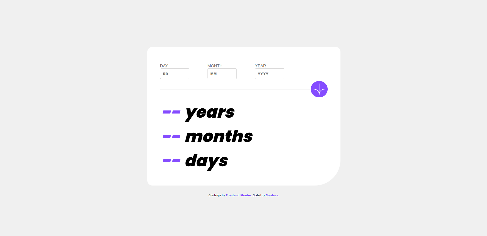

# Frontend Mentor - Age calculator app solution

This is a solution to the [Age calculator app challenge on Frontend Mentor](https://www.frontendmentor.io/challenges/age-calculator-app-dF9DFFpj-Q). 

## Table of contents

- [Overview](#overview)
- [The challenge](#the-challenge)
- [Screenshot](#screenshot)
- [Demo](#demo)
- [Features](#Features)
- [Built with](#built-with)
- [What I learned](#what-i-learned)

## Overview

The Age Calculator project is a simple web application built using HTML, CSS, and JavaScript. It provides a user-friendly interface for entering a birthdate and calculates the age based on the current date. The calculated age is displayed in years, months, and days.

## The challenge

Users should be able to:

- View an age in years, months, and days after submitting a valid date through the form
- Receive validation errors if:
  - Any field is empty when the form is submitted
  - The day number is not between 1-31
  - The month number is not between 1-12
  - The year is in the future
  - The date is invalid e.g. 31/04/1991 (there are 30 days in April)
- View the optimal layout for the interface depending on their device's screen size

## Screenshot

### Desktop Version

### Mobile Version

## Demo

You can check out a live demo of this website [here](https://xcordeva.github.io/FrontEndMentor-Challenges/age-calculator-app/).

## Features

- Age calculation based on the entered birthdate.
- Error handling for invalid input.
- Option to calculate age by clicking a "Calculate" button or pressing Enter.

## Built with

- Semantic HTML5 markup
- CSS custom properties
- Flexbox
- Javascript

## What I Learned

Throughout the development of this project, I gained valuable knowledge:

- **Date Manipulation:** I learned that working with dates in JavaScript can be complex and hard, specialy when dealing with complexities such as leap years and varying month lengths. It was challenging but it made me gain a deep understanding of how to calculate age accurately and work with date-related functions effectively.

